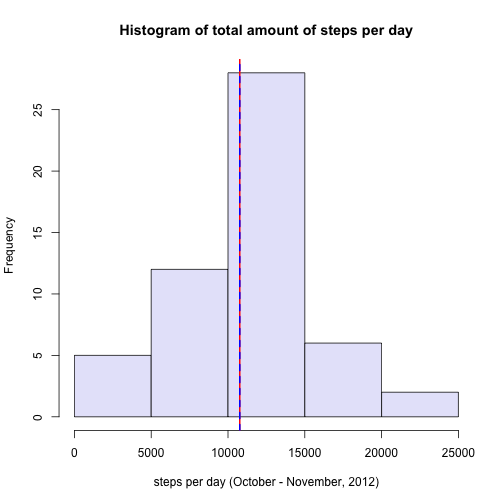
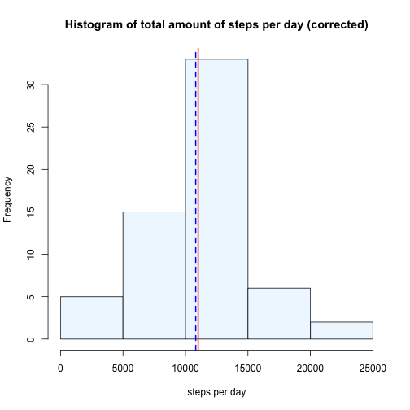
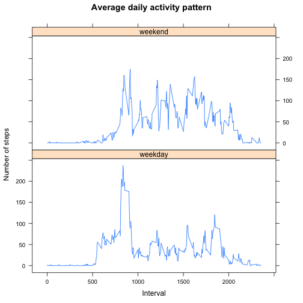

Reproducible Research: Peer Assessment 1
========================================


```r
knitr::opts_chunk$set(echo=TRUE)
```

<!--
Downloading a dataset from the internet and unzipping it into a local data
directory is a repeating chore. The `.LoadData()` function in 'load_data.R' does
just that. Because the 'activity.zip' is already part of the forked repository, 
we'll construct a local URL for the `urls` parameter of the function. But we
might also have used
https://d396qusza40orc.cloudfront.net/repdata%2Fdata%2Factivity.zip


```r
download.env <- new.env()
source("load_data.R", local = download.env)
download.env$.LoadData(file.path("file:/", getwd(), "activity.zip"))
```

```
## activity.zip already loaded: date of download: Fri Mar 13 14:43:13 2015
## See 'data/download_activity.zip.log' for details.
```

```r
rm(download.env)
```

Although the previous code chunck was *commented out* (for html) it is still
being processed by knitr.
-->

The dataset [Activity monitoring data][1] contains data from a personal activity 
monitoring device. This device collected data from a single person at 5 minute 
intervals through out
the day, during the months of October and November, 2012.  
The dataset is downloaded and unzipped in a single file as `data/activity.csv`.

## Loading and preprocessing the data

We can inspect the raw data by reading the first lines from the data file...

```r
data.file <- "data/activity.csv"
cat("<pre>\n", paste0(readLines(data.file, n = 5), collapse = "<br/>"), "\n</pre>", sep = "")
```

<pre>
"steps","date","interval"<br/>NA,"2012-10-01",0<br/>NA,"2012-10-01",5<br/>NA,"2012-10-01",10<br/>NA,"2012-10-01",15
</pre>

As we can see and already know from [other sources] [2] the data has 3 fields:

- **steps**: Number of steps taking in a 5-minute interval 
(missing values are coded as NA)
- **date**: The date on which the measurement was taken in YYYY-MM-DD format
- **interval**: Identifier for the 5-minute interval in which measurement was 
taken

A <a href="data/activity.csv" target="_blank">further inspection</a> of the data 
reveals several other things. But first, read in the raw data:


```r
data <- read.csv(data.file, stringsAsFactors = FALSE)
knitr::kable(tail(data, n = 3), format = "markdown")
```


|      | steps|date       | interval|
|:-----|-----:|:----------|--------:|
|17566 |    NA|2012-11-30 |     2345|
|17567 |    NA|2012-11-30 |     2350|
|17568 |    NA|2012-11-30 |     2355|

It looks like the `interval` is computed as *24-hour-digit + amount-of-minutes*,
so we might recompute `date` and `interval` as a continuous `time` field of 
type [POSIXct] [3], but inspecting the questions for this assignment, it looks
as though we do not need such a continuous `time` field. What we do need is
the notion of what day of the week the measurements were taken.


```r
data$date <- as.POSIXct(data$date)
data$day <- as.factor(weekdays(data$date, abbreviate = TRUE))
knitr::kable(data[287:290, ], format = "markdown")
```


|    | steps|date       | interval|day |
|:---|-----:|:----------|--------:|:---|
|287 |    NA|2012-10-01 |     2350|Mon |
|288 |    NA|2012-10-01 |     2355|Mon |
|289 |     0|2012-10-02 |        0|Tue |
|290 |     0|2012-10-02 |        5|Tue |

<a id="summary"/>
Here is a summary of the preprocessed data:

```r
knitr::kable(summary(data), format = "markdown")
```


|   |    steps        |     date                     |   interval      | day       |
|:--|:----------------|:-----------------------------|:----------------|:----------|
|   |Min.   :  0.00   |Min.   :2012-10-01 00:00:00   |Min.   :   0.0   |Fri:2592   |
|   |1st Qu.:  0.00   |1st Qu.:2012-10-16 00:00:00   |1st Qu.: 588.8   |Mon:2592   |
|   |Median :  0.00   |Median :2012-10-31 00:00:00   |Median :1177.5   |Sat:2304   |
|   |Mean   : 37.38   |Mean   :2012-10-30 23:32:27   |Mean   :1177.5   |Sun:2304   |
|   |3rd Qu.: 12.00   |3rd Qu.:2012-11-15 00:00:00   |3rd Qu.:1766.2   |Thu:2592   |
|   |Max.   :806.00   |Max.   :2012-11-30 00:00:00   |Max.   :2355.0   |Tue:2592   |
|   |NA's   :2304     |NA                            |NA               |Wed:2592   |

## What is mean total number of steps taken per day?

```r
aggdata1 <- aggregate(steps ~ date, data = data, sum)
aggdata2 <- aggregate(data$steps, by=list(data$date), FUN=sum, na.rm=TRUE)

meantotal <- as.integer(mean(aggdata1$steps))
mediantotal <- as.integer(median(aggdata1$steps))
```

There are 2304 missing values in 
the `steps` field.
While ignoring missing values, we can still calculate the number of steps
taken per day.  Depending on whether we want to include days with apparantly 
no values taken we have 53 (aggdata1) or 61 
(aggdata2) days where we
can calculate the total number of steps. And from there the mean total of steps
per day.

If we do not want missing values affect the mean calculation too much, we
go for the aggdata1 aggregation and
arive at a mean total of 10766 steps taken per day.


```r
hist(aggdata1$steps,
     main="Histogram of total amount of steps per day", 
     xlab="steps per day (October - November, 2012)",
     col = "lavender")
abline(v = mediantotal, col = "red", lwd = 2, lty = 1)
abline(v = meantotal, col = "blue", lwd = 2, lty = 2)
```

 

It appears there is a symetric distribution of the data, with mean and median 
values almost equal.

Mean total steps per day: 10766 (blue)  
Median total steps per day:  10765 (red)

## What is the average daily activity pattern?

The average daily activity pattern can be computed by taking the mean amount of
steps per 5-minute interval. The figure below illustrates this average daily
pattern.


```r
stin <- aggregate(steps ~ interval, data = data, mean)
mx <- stin$interval[which.max(stin$steps)]
my <- max(stin$steps)
mtext <- paste0(as.integer(mx/100), ":", mx %% 100, " AM, ", 
                as.integer(my), " steps on average")
plot(stin$interval, stin$steps, type="l", lwd = 2,
     main="Average daily activity pattern",
     ylab="steps per 5-minute interval",
     xlab="5-minute interval")
text(x = mx, y = my, labels = mtext, pos = 4, cex = 0.9)
```

 

The maximum activity takes place in the morning. At 8:35 AM, 206 steps on average are taken in a 
5-minute interval. The 
time corresponds to the interval notation 835.

## Imputing missing values


```r
missingvalues <- nrow(data[is.na(data$steps), ])
aggdata3 <- aggregate(data$steps, by=list(data$date), FUN=sum)
missingdays <- nrow(aggdata3[is.na(aggdata3$x), ])
lowdays <- nrow(aggdata3[aggdata3$x < 100, ])
```

The total number of missing values is 2304. As we have seen
[earlier] [4], there are only missing values in the column `steps`. These
missing values are concentrated in 8 days that have no values
at all. These 8 missing days are responsible for the total
amount of missing values: 12 * 24 * 8 = 2304.

There are also 9 days in which the person took less than 100 steps
for the whole day. These low values are in contrast with average amount of steps taken
each day, but whether this indicates a failure in the measurements or the
person was ill, very lazy or whatever we cannot say.

A strategy to input the missing values for the 8 days would be to compute the 
average values for day of the week and time of day and than replace the missing values by
the computed averages for that day of the week and time of day. Here we go.


```r
stind <- aggregate(steps ~ interval + day, data = data, mean)
colnames(stind) <- c("interval", "day", "avsteps")
newdata <- merge(data, stind, by = c("interval", "day"), all.x = TRUE, sort = FALSE)
newdata[is.na(newdata$steps), ]$steps <- round(newdata[is.na(newdata$steps), ]$avsteps)
newdata <- newdata[order(newdata$date, newdata$interval), ]
newdata <- newdata[, c(3, 4, 1, 2)]
row.names(newdata) <- NULL
knitr::kable(summary(newdata), format = "markdown")
```


|   |    steps        |     date                     |   interval      | day       |
|:--|:----------------|:-----------------------------|:----------------|:----------|
|   |Min.   :  0.00   |Min.   :2012-10-01 00:00:00   |Min.   :   0.0   |Fri:2592   |
|   |1st Qu.:  0.00   |1st Qu.:2012-10-16 00:00:00   |1st Qu.: 588.8   |Mon:2592   |
|   |Median :  0.00   |Median :2012-10-31 00:00:00   |Median :1177.5   |Sat:2304   |
|   |Mean   : 37.57   |Mean   :2012-10-30 23:32:27   |Mean   :1177.5   |Sun:2304   |
|   |3rd Qu.: 19.00   |3rd Qu.:2012-11-15 00:00:00   |3rd Qu.:1766.2   |Thu:2592   |
|   |Max.   :806.00   |Max.   :2012-11-30 00:00:00   |Max.   :2355.0   |Tue:2592   |
|   |NA               |NA                            |NA               |Wed:2592   |

Let's compare the new data with the old data, and see what is the impact of 
imputing missing data.


```r
aggdata <- aggregate(steps ~ date, data = newdata, sum)
newmeantotal <- as.integer(mean(aggdata$steps))
newmediantotal <- as.integer(median(aggdata$steps))
diffmean <- format(((newmeantotal - meantotal)/meantotal) * 100, 
                   digits = 2, nsmall = 1)
diffmedian <- format(((newmediantotal - mediantotal)/mediantotal) * 100, 
                     digits = 3, nsmall = 1)
hist(aggdata$steps,
     main="Histogram of total amount of steps per day (corrected)", 
     xlab="steps per day",
     col = "aliceblue")
abline(v = newmediantotal, col = "red", lwd = 2, lty = 1)
abline(v = newmeantotal, col = "blue", lwd = 2, lty = 2)
```

 

Below the mean and median steps per day according to the newly created dataset.
In brackets the value that was
computed earlier with the missing data still in the dataset.   
Blue: Mean total steps per day: 10821 (10766) 0.51%   
Red: Median total steps per day:  11015 (10765) 2.32%

The impact of imputing missing data on the estimates of the total daily number 
of steps is minimal. For mean and median this means an increase of
0.51% and 2.32% respectively.

## Are there differences in activity patterns between weekdays and weekends?

We'll create a new factor variable in the dataset with two levels - "weekday" 
and "weekend" indicating whether a given date is a weekday or weekend day.


```r
newdata$day.type <- as.factor(ifelse(newdata$day == "Sat" | newdata$day == "Sun",
                           "weekend", "weekday"))
str(newdata)
```

```
## 'data.frame':	17568 obs. of  5 variables:
##  $ steps   : num  1 0 0 0 0 5 0 0 0 0 ...
##  $ date    : POSIXct, format: "2012-10-01" "2012-10-01" ...
##  $ interval: int  0 5 10 15 20 25 30 35 40 45 ...
##  $ day     : Factor w/ 7 levels "Fri","Mon","Sat",..: 2 2 2 2 2 2 2 2 2 2 ...
##  $ day.type: Factor w/ 2 levels "weekday","weekend": 1 1 1 1 1 1 1 1 1 1 ...
```

The difference between activity levels for weekdays and weekends is
vizualised in the chart below.


```r
library(lattice)
stin <- aggregate(steps ~ interval + day.type, data = newdata, mean)
xyplot(steps ~ interval|day.type, data = stin, type = "l", layout=c(1,2),
       main = "Average daily activity pattern",
       ylab = "Number of steps",
       xlab = "Interval")
```

 

***
[1]: https://d396qusza40orc.cloudfront.net/repdata%2Fdata%2Factivity.zip
[2]: https://github.com/rdpeng/RepData_PeerAssessment1/blob/master/README.md
[3]: https://stat.ethz.ch/R-manual/R-devel/library/base/html/DateTimeClasses.html
[4]: #summary

